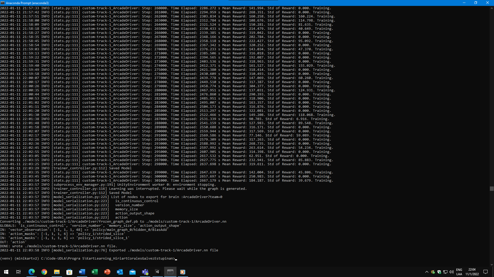

# KartLearning_HiriartCoralesGalvezEstupinan

Tarea de Machine Learning con Karts en Unity

Programacion V
- [Diego Hiriart](https://github.com/Diego-Hiriart)
- [Luis Corales](https://github.com/LuisCorales)
- [Daniela Estupiñan](https://github.com/Daniela-Estupinan)
- [Martin Galvez](https://github.com/MGA1398)

## Detalles del entrenamiento
- Se entrenó al modelo con un solo MLAgent.
- Se realizaron cerca de 300.000 pasos para el entrenamiento.
- Se detuvo el entrenamiento cuando se observó que se estabilizaba la media de recompensas entre 150 y 300. Y la desviación estándar tendía a ser 0 constantemente.

## Implementación del Ghosting
Para implementar el Ghost Driver con cada vuelta que realice el MLAgent se programó lo siguiente:
- Se creó un trigger collider que indica si el MLAgent pudo completar la vuelta en la pista. 
- Al dar una vuelta, el script activa la reproducción del Ghost Driver.

NOTA: No se incluyó el ambiente virtual ya que es muy pesado, pero se incluyó un archivo requirements.txt que indica los paquetes necesarios para generar un ambiente igual. Solamente se incluye el modelo resultante del entrenamiento.
